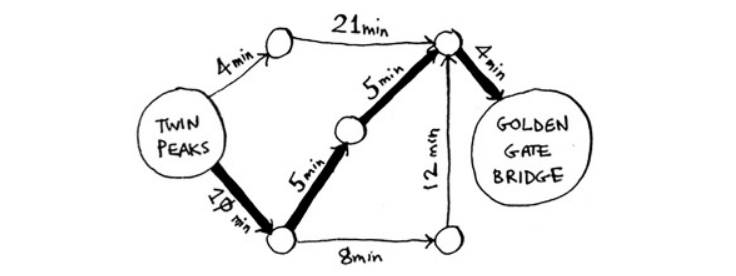
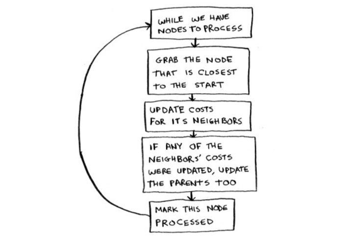
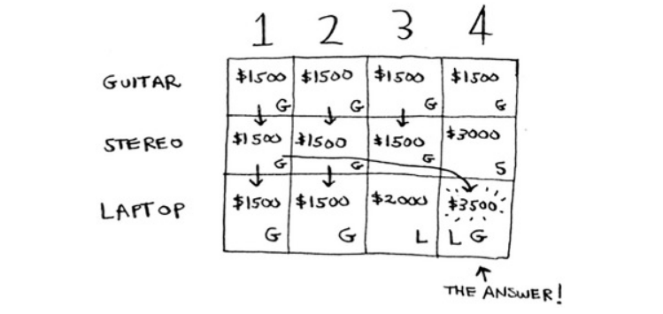
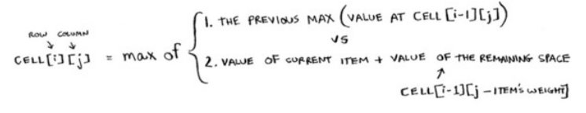
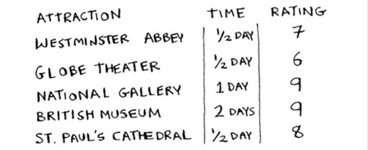
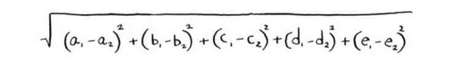

# Grokking Algorithms

Notes while reading Grokking Algorithms by Aditya Y. Bhargava

<!-- toc -->

- [Ch.1 Introduction to Algorithms](#ch1-introduction-to-algorithms)
  * [Binary Search](#binary-search)
  * [Big O Notation](#big-o-notation)
    + [Common Big O run times](#common-big-o-run-times)
  * [Takeaways](#takeaways)
- [Ch.2 Selection Sort](#ch2-selection-sort)
  * [Linked Lists vs Arrays](#linked-lists-vs-arrays)
  * [Selection Sort](#selection-sort)
- [Ch.3 Recursion](#ch3-recursion)
  * [Recursion](#recursion)
  * [Stack](#stack)
- [Ch.4 Quicksort](#ch4-quicksort)
  * [Divide-and-conquer](#divide-and-conquer)
    + [Method](#method)
    + [Example](#example)
  * [Quicksort](#quicksort)
  * [Recap](#recap)
- [Ch.5 Hash Tables](#ch5-hash-tables)
  * [Hash functions](#hash-functions)
    + [Checking duplicates](#checking-duplicates)
    + [Recap](#recap-1)
  * [Collisions and Performance](#collisions-and-performance)
  * [Recap](#recap-2)
- [Ch.6 Breadth-first Search](#ch6-breadth-first-search)
  * [Graphs](#graphs)
  * [Breadth-first Search (BFS)](#breadth-first-search-bfs)
    + [Queues](#queues)
  * [BFS in code with hash tables](#bfs-in-code-with-hash-tables)
    + [Running time](#running-time)
  * [Recap](#recap-3)
- [Ch.7 Dijkstra's algorithm](#ch7-dijkstras-algorithm)
  * [Dijkstra's algorithm](#dijkstras-algorithm)
    + [Steps](#steps)
    + [Implementation in code](#implementation-in-code)
  * [Recap](#recap-4)
- [Ch.8 Greedy Algorithms](#ch8-greedy-algorithms)
  * [Greedy algorithm](#greedy-algorithm)
  * [Set-covering problem](#set-covering-problem)
    + [Example: Radio station coverage throughout USA](#example-radio-station-coverage-throughout-usa)
  * [NP-complete problems](#np-complete-problems)
    + [How to determine if problem is NP-complete](#how-to-determine-if-problem-is-np-complete)
  * [Recap](#recap-5)
- [Ch.9 Dynamic Programming](#ch9-dynamic-programming)
  * [Dynamic Programming](#dynamic-programming)
  * [Examples of dynamic programming in real-life](#examples-of-dynamic-programming-in-real-life)
  * [Example 1: the knapsack problem](#example-1-the-knapsack-problem)
    + [Naive solution: Brute force method](#naive-solution-brute-force-method)
    + [Solving knapsack problem with dynamic programming](#solving-knapsack-problem-with-dynamic-programming)
  * [Example 2: travel optimization problem](#example-2-travel-optimization-problem)
    + [Creating the grid](#creating-the-grid)
  * [Example 3: camping items list](#example-3-camping-items-list)
    + [Creating the grid](#creating-the-grid-1)
  * [Example 4: Longest common substring](#example-4-longest-common-substring)
    + [Making the grid](#making-the-grid)
    + [Longest common subsequence](#longest-common-subsequence)
  * [Example 5. Levenshtein distance (edit distance)](#example-5-levenshtein-distance-edit-distance)
  * [Recap](#recap-6)
- [Ch.10 K-nearest Neighbors](#ch10-k-nearest-neighbors)
  * [K-nearest Neighbors (KNN)](#k-nearest-neighbors-knn)
  * [Distance formula](#distance-formula)
  * [Cosine similarity](#cosine-similarity)
  * [Recap](#recap-7)

<!-- tocstop -->

# Ch.1 Introduction to Algorithms

## Binary Search

- With binary search, you guess the middle number and eliminate half the remaining numbers every time.
- When talking about running time in Big O notation, log always means log<sub>2</sub>.
- In general, for any list of `n`, binary search will take log<sub>2</sub>`n` steps to run in the worst case, whereas simple search will take `n` steps.
  - For a list of 8 numbers, binary search will require log<sub>2</sub>8 (3).
  - For a list of 1024 numbers, binary search will require log<sub>2</sub>1024 (10) 
- Binary search only work if your list is in sorted order.
- Binary search runs in _logarithmic time_, as opposed to _linear time_
  - For example, what takes a simple search 100ms to run can be done in 7ms with binary search (log<sub>2</sub>100).

__Exercises__

> Suppose you have a sorted list of 128 names, and you’re searching through it using binary search. What’s the maximum number of steps it would take?
> What about double the size?

```py
import math
math.log2(128) # 7.0
math.log2(256) # 8.0
```

## Big O Notation

- __Big O Notation__ is a special type of notation that tells you how fast an algorithm is.
- Big O lets you __compare the number of operations__ between algorithms.
  - `O(n)`: `O` is "Big O", `n` is number of operations.
- For example, given a list of size `n`:
  - Simple search needs to check each element. Run time in Big O is `O(n)`
  - Binary search needs to log `n` operations to check the same. Run time in Big O is `O(log n)`

### Common Big O run times

Sorted from fastest to slowest:
- `O(log n)`, also known as log time. Example: Binary search.
- `O(n),` also known as linear time. Example: Simple search.
- `O(n * log n).` Example: A fast sorting algorithm, like quicksort (coming up in chapter 4).
- `O(n2)`. Example: A slow sorting algorithm, like selection sort (coming up in chapter 2).
- `O(n!)`. Example: A really slow algorithm, like the traveling salesperson (coming up next!).

## Takeaways

- Algorithm speed isn’t measured in seconds, but in growth of the number of operations.
- Instead, we talk about how quickly the run time of an algorithm increases as the size of the input increases.
- Run time of algorithms is expressed in Big O notation.
- O(log n) is faster than O(n), but it gets a lot faster as the list of items you’re searching grows.

---

# Ch.2 Selection Sort

## Linked Lists vs Arrays

In Python, Linked Lists = Dicts and Arrays = Lists.

- LLs are more efficients than arrays because each items doesn't have to be adjacent in memory.
  - Each item in a linked list has the address of next item.
- OTOH, arrays are faster at reading elements since they are next to each other.
- Arrays have fast reads and slow inserts.
- Linked Lists have slow reads and fast inserts.
- Linked Lists are easier to insert elements into the middle. Array require reshuffling.  Same with deleting items.

## Selection Sort 

- Used for sorting names, dates, etcs.
- Slower than Quicksort (explained later)
- Big O: `O(n)`, 
  - Each sorting operation requires algorithm to check each item in the list.
  - Big O is constant even though the number of items to check decreases each time.  Technically, selection sort is `O(n*0.5n)` based on average number of checks in a list, but constants like `0.5` are ignored in Big O notation.

---

# Ch.3 Recursion

## Recursion 

- Every recursive function has 2 parts:
  1. __base case__ - when to break out of recursion
  2. __recursive case__ - the recursive action

```py
def countdown(i):
  print(i)
  if i <= 1:  # base case
    return
  else:
    countdown(i-1) # recursive case
```

## Stack

- A stack is a linear data structure which follows a particular order in which the operations are performed. The order may be LIFO (Last In First Out) or FILO (First In Last Out).
- When you call a function from another function, the calling function is paused in a partially completed state.
  - Imagine a plate of dishes - the first one placed will be the last one used.
- Recursion is more memory intensive than a loop because each function calls must be saved to memory. Can get around this by using a `for` loop. 

---

# Ch.4 Quicksort

## Divide-and-conquer

- __quicksort__ is a type of D&C algorithm
- it's a sorting algorithm

### Method

1. Figure out base case, ie. the simplest possible case
2. Divide or decrease your problem until it becomes the base case.

### Example

Given an array of number, sum the numbers and return the total in a recursive way.

```py
def my_sum(arr):
  if len(arr) == 0:
    return 0
  else:
    arr.pop() + my_sum(arr)

```

## Quicksort

1. Pick a pivot
2. Partition the array into two sub-arrays: elements less than the pivot and elements greater than the pivot.
3. Call quicksort recursively on the two sub-arrays.

Quicksort performance heavily depends on the pivot you use. If you're taking the pivot from the first item in a list, it is functioning basically the same way as going through a loop. If you start from the middle of the array, it would be much faster.

Taking the pivot from the first item in a list would be the worst-case scenario (height of call stack stack is `O(n)`, while taking a pivot from the middle would be a best case scenario (height of the call stack is `O(log n)`.  If you always choose a random element as the pivot, __you will get the best case consistently__.


## Recap

- D&C works by breaking a problem down into smaller and smaller pieces. If you’re using D&C on a list, the base case is probably an empty array or an array with one element.
- If you’re implementing quicksort, choose a random element as the pivot. The average runtime of quicksort is `O(n log n)`!
- The constant in Big O notation can matter sometimes. That’s why quicksort is faster than merge sort.
- The constant almost never matters for simple search versus binary search, because `O(log n)` is so much faster than `O(n)` when your list gets big.

---

# Ch.5 Hash Tables

## Hash functions

- A hash function is a function that maps strings to numbers.
- The number can be associated to the index of an array, in which the index stores the return value (number, string, etc)
- The hash function knows how big your array is and only returns valid indexes.
- Has many names, depending on language: hash maps, maps, dictionaries, and associative arrays

### Checking duplicates

In Python, the dictionary object has the `get()` function which returns a value if the key is in the hash table.  If not, it will return `None`.

Since it doesn't have to check every item in a list like an array, ideally it will have _constant time_, ie. it has a call stack height of `O(1)` where the time taken to perform an operation stays the same, regardless of how big the hash table is.

Simplified example of how caching works:

```py
def get_page(url):
  if cache.get(url):
    return cache[url]
  else:
    data = get_data_from_server(url)
    cache[url] = data
    return data
```

### Recap

Hash tables are good for:
- Modeling relationships from one thing to another thing
- Filtering out duplicates
- Caching/memorizing data instead of making your server do work

## Collisions and Performance

- Ideally, your hash function should map keys evenly all over the hash. When it doesn't and map keys to the same hash, it's called a _collision_. To get around this, a simple workaround is to use a _linked list_.
- A poor hash function could map all keys to a single slot and create one long _linked list_ (i.e. a key with an value that maps to another key and so forth).  This would be as slow as putting all the items in a list.
- To avoid collisions, you need 1) a low load factor (number of items in a hash table / total number of slots) and 2) a good hash function.


## Recap

- You can make a hash table by combining a hash function with an array.
- Collisions are bad. You need a hash function that minimizes collisions.
- Hash tables have really fast search, insert, and delete.
- Hash tables are good for modeling relationships from one item to another item.
- Once your load factor is greater than 0.7, it’s time to resize your hash table.
- Hash tables are used for caching data (for example, with a web server).
- Hash tables are great for catching duplicates.

---

# Ch.6 Breadth-first Search

## Graphs

- A graph models a set of connections (e.g. train stations in a rail line)
- Graphs are made of nodes (station), and edges (rail). 
- A node can be connected to many other nodes.
- __Directed graphs__ show one-way relationships with an arrow.  This is used if relationships only go one-way.
- __Topological graph__ is a linear ordering of its vertices such that for every directed edge `uv` from vertex `u` to vertex `v`, `u` comes before `v` in the ordering.
- A __tree__ is a type of graph where no edges ever point back (think family tree).

## Breadth-first Search (BFS)

Answers 2 types of Qs:
1. Is there a path from node A to node B?
  - FUQ: If there isn't a path at the base node, check its connected node to see if those are connected to node B.
2. What is the shortest path from node A to node B?
  - Meaning, what is the smallest number of nodes/edges required to get to node B?

### Queues
- Graphs depend on a _queue_, ie. the order in which nodes are added to determine proximity to the base node.
- A queue is a type of data structure with 2 operations: __enqueue__ (push) and __dequeue__ (pop)
  - enqueue adds an item to the end of a list (`i[-1]`)
  - enqueue takes an item of at index 0 of a list (`i[0]`)
  - follows the FIFO (first in, first out) structure. A stack, in opposite, is LIFO.

## BFS in code with hash tables

Mapping a rail line network:

```py
graph = {}
graph["umeda"] = ["tsukamoto", "tenma", "shin osaka"]
graph["tsukamoto"] = ["umeda", "amagasaki"]
graph["amagasaki"] = ["tsukamoto", "kashima"]
graph["tenma"] = ["umeda", "sakuranomiya"]
graph["shin osaka"] = ["umeda", "higashiyodogawa"]
graph["sakuranomiya"] = []
graph["higashiyodogawa"] = []
graph["kashima"] = []


```

Implementing a BFS using the rail network

```py
from collections import deque

def search(base_node, destination_node):
    # create new queue, and add all of base node's neighbors to the search queue
    search_queue = deque()
    search_queue += graph[base_node]

    # while queue isn't empty, get first item off queue
    # check if item hasn't already been searched AND is destination.
    # return True if destination.
    # if not, add all of the item's neighbors and do it again.
    searched = {base_node}
    steps = 0
    while search_queue:
        node = search_queue.popleft()
        if node not in searched:
            if node == destination_node:
                print(f"Found destination in {steps} steps: {node}")
                return True
            else:
                print(f"{node} not destination. Checking its neighbors.")
                search_queue += graph[node]
                searched.add(node)
                steps += 1
    return False
```

### Running time

Breadth-first search takes `O(number of nodes + number of edges)`, more commonly written as `O(V+E)` where V is "number of vertices" and E is "number of edges"


## Recap

- Breadth-first search tells you if there’s a path from A to B.
- If there’s a path, breadth-first search will find the shortest path.
- If you have a problem like “find the shortest X,” try modeling your problem as a graph, and use breadth-first search to solve.
- A directed graph has arrows, and the relationship follows the direction of the arrow (rama -> adit means “rama owes adit money”).
- Undirected graphs don’t have arrows, and the relationship goes both ways (ross - rachel means “ross dated rachel and rachel dated ross”).
- Queues are FIFO (First In, First Out).
- Stacks are LIFO (Last In, First Out).
- You need to check people in the order they were added to the search list, so the search list needs to be a queue. Otherwise, you won’t get the shortest path.
- Once you check someone, make sure you don’t check them again. Otherwise, you might end up in an infinite loop.

---

# Ch.7 Dijkstra's algorithm

## Dijkstra's algorithm

The algorithm is similar to BFS, but takes into account the _weight_ of each edge. This is useful when each edge has different _costs_ (like time it takes to get from node A to node B). BFS only finds the path with the fewest segments (i.e. edges).

Weighted graph with the fastest path in bold


- Use BFS for _unweighted graphs_ and use Dijkstra's algo for _weighted graphs_ with _no cycles_, ie. unidirected graph.
- D's algorithm can't have _negative weight_.

### Steps

1. Find the "cheapest" node.  This is the node with the least weight.
2. Update the costs of the neighbors of this node.
3. Repeat until you've done this for every node in the graph.
4. Calculate the final path.

### Implementation in code



- Need 3 hash tables (graph, costs, parents)
- You'll update costs and parents hash tables as the algorithm progresses.

[link to code](./code/ch7_dijkstras_algorithm.py)

## Recap

- Breadth-first search is used to calculate the shortest path for an unweighted graph.
- Dijkstra’s algorithm is used to calculate the shortest path for a weighted graph.
- Dijkstra’s algorithm works when all the weights are positive.
- If you have negative weights, use the Bellman-Ford algorithm.

---

# Ch.8 Greedy Algorithms

## Greedy algorithm

- Chooses the most optimal choice at each steps as it attempts to find the overall optimal way to solve the entire problem.
- Doesn't purport to have the most optimal solution overall.

Examples:

1. Packing a truck with different sized boxes: Greedy strategy would be to keep picking the largest box that will fit in the remaining space until you can't pack any more boxes.
2. Thief stealing in a store: Greedy strategy would be to pick the most expensive things until you can't fit your bag.


## Set-covering problem

Wiki definition: Given a set of elements `{1,2,..n}` (called the universe) and a collection `S of m` sets whose union equals the universe, the set cover problem is to identify the smallest sub-collection of `S whose union equals the universe. 

### Example: Radio station coverage throughout USA

__Question__: Given a list of radio stations, each with coverage over different states, how to derive the least number of radio stations needed to cover all 50 states.

- __Power set__: Naive approach is to list every possible subset of stations and pick the set with the smallest number of stations (sounds like traveling salesman?). Takes `O(2^n)` time since there are 2^n subsets.
- __Approximation algorithm__: Pick the stations that covers the most states that haven't been covered yet. Repeat until all states are covered. This is a type of greedy algorithm.
  - AAs are judged by 1) speed and 2) how close they are to the optimal solution.

[link to code](./code/ch8_greedy_algorithms.py)

## NP-complete problems

NP-complete = _"nondeterministic polynomial-time complete"_

From wiki - 
> In computational complexity theory, a problem is NP-complete when:
> 1. a brute-force search algorithm can solve it, and the correctness of each solution can be verified quickly, and
> 2. the problem can be used to simulate any other problem with similar solvability.

- Both traveling-salesperson and set-covering problems are NP-complete problems. They both try to calculate every possible solution and pick the smallest/shortest one.
- These problems are difficult to solve and impossible to write an algorithm that will solve these problems quickly.
- This is where approximation algorithms (like greedy algo) come in, where it does a "good enough" job. 

### How to determine if problem is NP-complete

No set format, but some characteristics:
- Your algorithm runs quickly with a handful of items but really slows down with more items.
- “All combinations of X” usually point to an NP-complete problem.
- Do you have to calculate “every possible version” of X because you can’t break it down into smaller sub-problems? Might be NP-complete.
- If your problem involves a sequence (such as a sequence of cities, like traveling salesperson), and it’s hard to solve, it might be NP-complete.
- If your problem involves a set (like a set of radio stations) and it’s hard to solve, it might be NP-complete.
- Can you restate your problem as the set-covering problem or the traveling-salesperson problem? Then your problem is definitely NP-complete.


## Recap 

- Greedy algorithms optimize locally, hoping to end up with a global optimum.
- NP-complete problems have no known fast solution.
- If you have an NP-complete problem, your best bet is to use an approximation algorithm.
- Greedy algorithms are easy to write and fast to run, so they make good approximation algorithms.

---

# Ch.9 Dynamic Programming

## Dynamic Programming

- Refers to simplifying a complicated problem by breaking it down into simpler sub-problems in a recursive manner.
- Useful when you're trying to optimize something given a constraint.
- Limitation: Only works when each subproblem is discrete (doesn't depend on other subproblems)

- Every dynamic-programming solution involves a grid.
- The values in the cells are usually what you’re trying to optimize. For the knapsack problem, the values were the value of the goods.
- Each cell is a subproblem, so think about how you can divide your problem into subproblems. That will help you figure out what the axes are.

## Examples of dynamic programming in real-life

- Biologists use the longest common subsequence to find similarities in DNA strands. They can use this to tell how similar two animals or two diseases are. The longest common subsequence is being used to find a cure for multiple sclerosis.
- Have you ever used diff (like git diff)? Diff tells you the differences between two files, and it uses dynamic programming to do so.
- We talked about string similarity. Levenshtein distance measures how similar two strings are, and it uses dynamic programming. Levenshtein distance is used for everything from spell-check to figuring out whether a user is uploading copyrighted data.
- Have you ever used an app that does word wrap, like Microsoft Word? How does it figure out where to wrap so that the line length stays consistent? Dynamic programming!

## Example 1: the knapsack problem

A thief has a knapsack that can carry 4 lbs of goods. The goods in the store and their weight / price are:

1. stereo: 4lbs, $3000
2. laptop: 3lbs, $2000
3. guitar: 1lbs, $1500

Get the maximum money's worth of goods.

### Naive solution: Brute force method

- Brute force method is to try every possible set of goods
- Very slow `O(n^2)`, time increases exponentially with more items.

### Solving knapsack problem with dynamic programming

1. Create a grid where rows are items, and columns are weights. Columns signify weight capacity of knapsack.
2. For each row, you calculate the best guess for what the thief should steal, with prior row's knowledge but not for subsequent rows.

- For 1st row (e.g. guitar), the max value you could put in the knapsack with first row would be $1500 (ie. 1 guitar) no matter each weight capacity.
- For 2nd row, you have knowledge of both guitar and stereo. For each column (ie weight capacity) choose the optimal solution given this capacity.
- For 3rd row, column 1 & 2's optimal solution is just a guitar, but at column 3 we have capacity for a laptop. For 4th column the combo of stereo + laptop is calculated as optimal solution.

__Dynamic programming grid__



__Dynamic programming formula__



## Example 2: travel optimization problem

You have 2 days to spend in London, and the following destinations, its time, and rating. Create an itinerary that gets the highest number of ratings total.



### Creating the grid

| Destination (Time, Rating) | 0.5 | 1 | 1.5 | 2 |
|:---------------------------|:----|:--|:----|:--|
| Westminster (0.5, 7)       | W (7)  | W (7)  | W (7) | W (7) |
| Globe Theatre (0.5, 6)     | W (7)  | W+G (13)  | W+G (13)   | W+G (13) |
| National Gallery (1, 9)    | W (7)  | W+G (13)  | N+W (16)  | N+W+G (22) |
| British Museum (2, 9)      | W (7)  | W+G (13)  | N+W (16)  | N+W+G (22) |
| St. Paul's  (0.5, 8)       | S (8)  | W+S (15)  | N+S (17)  | __N+W+S (24)__ |

__Optimal solution with 2 days is Westminster + St. Pauls + National Gallery for a total of 24 ratings__

## Example 3: camping items list

You're going on a camping trip and you have a knapsack that holds 6lbs. You have a list of items with weight and importance rating.  Finding the optimal list of items to get highest sum of importance.

### Creating the grid

| Items (Weight, Rating) | 1     | 2     | 3      | 4       | 5      | 6       | 
|:-----------------------|:--|:--|:--|:--|:--|:--|
| Water (3lb, 10)        | 0     | 0     | W (10) | W (10)  | W (10)  | W (10)    | 
| Book (1lb, 3)          | B (3) | B (3) | W (10) | W+B (13)| W+B (13)| W+B (13)  | 
| Food (2lb, 9)          | B (3) | F (9) | W (10) | W+B (13)| W+F (19)| W+B+F (22)| 
| Jacket (2lb, 5)        | B (3) | F (9) | W (10) | F+J (14)| W+F (19)| W+B+F (22)| 
| Camera (1lb, 6)        | B (3) | F (9) | W (10) | F+J (14)| W+F (19)| W+F+C (25)| 

__Optimal solution is Water + Food + Camera for a total of 25 rating__

## Example 4: Longest common substring

Suppose you run dictionary.com. Someone types in a word, and you give them the definition. But if someone misspells a word, you want to be able to guess what word they meant. Alex is searching for fish, but he accidentally put in hish. That’s not a word in your dictionary, but you have a list of words that are similar. Alex typed _hish_. Which word did Alex mean to type: _fish_ or _vista_?

### Making the grid

Objective: Dynamic programming tries to _maximize_ something. In this case, it'd be the longest substring the two words have in common.

Variables to consider
- Values of the cells: Length of the longest substring that the two strings have in common. 
- Axes of the grid: X = misspelled query, Y = word in dictionary)
- How to divide problem into subproblems.
  - if letters don't match, value is zero
  - if they do match, value of top left neighbor + 1

1. "hish" vs "fish"
| Word in dict | H    | I    | S    | H    | 
|:-------------|:-----|:-----|:-----|:-----|
| F            | 0    | 0    | 0    | 0    | 
| I            | 0    | 1    | 0    | 0    | 
| S            | 0    | 0    | 2    | 0    | 
| H            | 1    | 0    | 0    | 3    | 

__Max matching substring is 3__

2. "hish" vs "vista"

| Words in dict | V | I | S | T | A | 
|:--------------|:--|:--|:--|:--|:--|
| H             | 0 | 0 | 0 | 0 | 0 | 
| I             | 0 | 1 | 0 | 0 | 0 | 
| S             | 0 | 0 | 2 | 0 | 0 | 
| H             | 0 | 0 | 0 | 0 | 0 | 

__Max matching substring is 2__


### Longest common subsequence

The above calculates the _longest common substring_, but not the _longest common subsequence_.

Calculate longest common subsequence of "fosh" between "fish" and "fort".

- if letters don't match, pick the larger number of top and left cells.
- if they do match, value is value of top-left neighbor + 1

1. "fosh" vs "fish"

| Word in dict | F | O | S | H |
|:-------------|:--|:--|:--|:--|
| F            | 1 | 1 | 1 | 1 |
| I            | 1 | 1 | 1 | 1 |
| S            | 1 | 1 | 2 | 2 |
| H            | 1 | 1 | 2 | 3 |


2. "fosh" vs "fort"

| Word in dict | F | O | S | H |
|:-------------|:--|:--|:--|:--|
| F            | 1 | 2 | 2 | 2 |
| O            | 1 | 2 | 2 | 2 |
| R            | 1 | 2 | 2 | 2 |
| T            | 1 | 2 | 2 | 2 |

pseudocode:

```py
if word_a[i] == word_b[j]: # letters match
  cell[i][j] = cell[i-1][j-1] + 1
else:
  cell[i][j = max(cell[i-1][j], cell[i][j-1])
```


## Example 5. Levenshtein distance (edit distance)

Given two words ("normal", "norway"), calculate the sum of insertion, substitution and deletion counts.

[link to code](code/ch9_dynamic_programming.py)


## Recap

- Dynamic programming is useful when you’re trying to optimize something given a constraint.
- You can use dynamic programming when the problem can be broken into discrete subproblems.
- Every dynamic-programming solution involves a grid.
- The values in the cells are usually what you’re trying to optimize.
- Each cell is a subproblem, so think about how you can divide your problem into subproblems.
- There’s no single formula for calculating a dynamic-programming solution.

---

# Ch.10 K-nearest Neighbors

## K-nearest Neighbors (KNN)

2 uses of KNN (from Wiki):

1. Classification - the output is a class membership. An object is classified by a plurality vote of its neighbors, with the object being assigned to the class most common among its k nearest neighbors
2. Regression - the output is the property value for the object. This value is the average of the values of k nearest neighbors.

- With KNN, choosing the right features is very important.
- Case in point, for a recommendation system, you'll want:
  1. Features that directly correlate to the what you are trying to recommend
  2. Features that don't have a bias (ie. balanced sample)

## Distance formula

__Distance formula__ measures the distance between two vectors using the Pythagorean formula. 

- Smaller the number, the more similar they are.


The formula can be expanded to multiple features.



Techniques
1. Normalizing - scaling different features
2. Weighting - weighing certain neighbors higher than others.


## Cosine similarity

__Cosine similarity__ compares the angles of the two vectors.


## Recap

- KNN is used for classification and regression and involves looking at the k-nearest neighbors.
- Classification = categorization into a group.
- Regression = predicting a response (like a number).
- Feature extraction means converting an item (like a fruit or a user) into a list of numbers that can be compared.
- Picking good features is an important part of a successful KNN algorithm.

