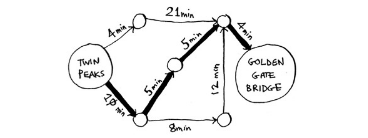

# Ch.7 Dijkstra's algorithm

## Dijkstra's algorithm

The algorithm is similar to BFS, but takes into account the _weight_ of each edge. This is useful when each edge has different _costs_ (like time it takes to get from node A to node B). BFS only finds the path with the fewest segments (i.e. edges).

Weighted graph with the fastest path in bold

- Use BFS for _unweighted graphs_ and use Dijkstra's algo for _weighted graphs_ with _no cycles_, ie. unidirected graph.
- D's algorithm can't have _negative weight_.

### Steps

1. Find the "cheapest" node.  This is the node with the least weight.
2. Update the costs of the neighbors of this node.
3. Repeat until you've done this for every node in the graph.
4. Calculate the final path.

### Implementation in code

- Need 3 hash tables (graph, costs, parents)
- You'll update costs and parents hash tables as the algorithm progresses.

[link to code](./code/ch7_dijkstras_algorithm.py)

## Recap

- Breadth-first search is used to calculate the shortest path for an unweighted graph.
- Dijkstra’s algorithm is used to calculate the shortest path for a weighted graph.
- Dijkstra’s algorithm works when all the weights are positive.
- If you have negative weights, use the Bellman-Ford algorithm.
