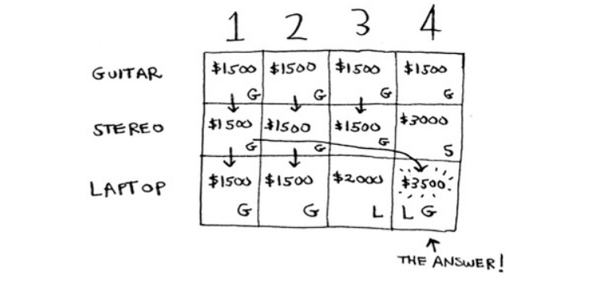
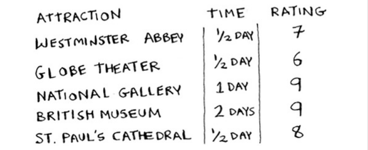

# Ch.9 Dynamic Programming

## Dynamic Programming

- Refers to simplifying a complicated problem by breaking it down into simpler sub-problems in a recursive manner.
- Useful when you're trying to optimize something given a constraint.
- Limitation: Only works when each subproblem is discrete (doesn't depend on other subproblems)

- Every dynamic-programming solution involves a grid.
- The values in the cells are usually what you’re trying to optimize. For the knapsack problem, the values were the value of the goods.
- Each cell is a subproblem, so think about how you can divide your problem into subproblems. That will help you figure out what the axes are.

## Examples of dynamic programming in real-life

- Biologists use the longest common subsequence to find similarities in DNA strands. They can use this to tell how similar two animals or two diseases are. The longest common subsequence is being used to find a cure for multiple sclerosis.
- Have you ever used diff (like git diff)? Diff tells you the differences between two files, and it uses dynamic programming to do so.
- We talked about string similarity. Levenshtein distance measures how similar two strings are, and it uses dynamic programming. Levenshtein distance is used for everything from spell-check to figuring out whether a user is uploading copyrighted data.
- Have you ever used an app that does word wrap, like Microsoft Word? How does it figure out where to wrap so that the line length stays consistent? Dynamic programming!

## Example 1: the knapsack problem

A thief has a knapsack that can carry 4 lbs of goods. The goods in the store and their weight / price are:

1. stereo: 4lbs, $3000
2. laptop: 3lbs, $2000
3. guitar: 1lbs, $1500

Get the maximum money's worth of goods.

### Naive solution: Brute force method

- Brute force method is to try every possible set of goods
- Very slow `O(n^2)`, time increases exponentially with more items.

### Solving knapsack problem with dynamic programming

1. Create a grid where rows are items, and columns are weights. Columns signify weight capacity of knapsack.
2. For each row, you calculate the best guess for what the thief should steal, with prior row's knowledge but not for subsequent rows.

- For 1st row (e.g. guitar), the max value you could put in the knapsack with first row would be $1500 (ie. 1 guitar) no matter each weight capacity.
- For 2nd row, you have knowledge of both guitar and stereo. For each column (ie weight capacity) choose the optimal solution given this capacity.
- For 3rd row, column 1 & 2's optimal solution is just a guitar, but at column 3 we have capacity for a laptop. For 4th column the combo of stereo + laptop is calculated as optimal solution.

__Dynamic programming grid__



__Dynamic programming formula__


## Example 2: travel optimization problem

You have 2 days to spend in London, and the following destinations, its time, and rating. Create an itinerary that gets the highest number of ratings total.



### Creating the grid

| Destination (Time, Rating) | 0.5 | 1 | 1.5 | 2 |
|:---------------------------|:----|:--|:----|:--|
| Westminster (0.5, 7)       | W (7)  | W (7)  | W (7) | W (7) |
| Globe Theatre (0.5, 6)     | W (7)  | W+G (13)  | W+G (13)   | W+G (13) |
| National Gallery (1, 9)    | W (7)  | W+G (13)  | N+W (16)  | N+W+G (22) |
| British Museum (2, 9)      | W (7)  | W+G (13)  | N+W (16)  | N+W+G (22) |
| St. Paul's  (0.5, 8)       | S (8)  | W+S (15)  | N+S (17)  | __N+W+S (24)__ |

__Optimal solution with 2 days is Westminster + St. Pauls + National Gallery for a total of 24 ratings__

## Example 3: camping items list

You're going on a camping trip and you have a knapsack that holds 6lbs. You have a list of items with weight and importance rating.  Finding the optimal list of items to get highest sum of importance.

### Creating the grid

| Items (Weight, Rating) | 1     | 2     | 3      | 4       | 5      | 6       | 
|:-----------------------|:--|:--|:--|:--|:--|:--|
| Water (3lb, 10)        | 0     | 0     | W (10) | W (10)  | W (10)  | W (10)    | 
| Book (1lb, 3)          | B (3) | B (3) | W (10) | W+B (13)| W+B (13)| W+B (13)  | 
| Food (2lb, 9)          | B (3) | F (9) | W (10) | W+B (13)| W+F (19)| W+B+F (22)| 
| Jacket (2lb, 5)        | B (3) | F (9) | W (10) | F+J (14)| W+F (19)| W+B+F (22)| 
| Camera (1lb, 6)        | B (3) | F (9) | W (10) | F+J (14)| W+F (19)| W+F+C (25)| 

__Optimal solution is Water + Food + Camera for a total of 25 rating__

## Example 4: Longest common substring

Suppose you run dictionary.com. Someone types in a word, and you give them the definition. But if someone misspells a word, you want to be able to guess what word they meant. Alex is searching for fish, but he accidentally put in hish. That’s not a word in your dictionary, but you have a list of words that are similar. Alex typed _hish_. Which word did Alex mean to type: _fish_ or _vista_?

### Making the grid

Objective: Dynamic programming tries to _maximize_ something. In this case, it'd be the longest substring the two words have in common.

Variables to consider
- Values of the cells: Length of the longest substring that the two strings have in common. 
- Axes of the grid: X = misspelled query, Y = word in dictionary)
- How to divide problem into subproblems.
  - if letters don't match, value is zero
  - if they do match, value of top left neighbor + 1

1. "hish" vs "fish"
| Word in dict | H    | I    | S    | H    | 
|:-------------|:-----|:-----|:-----|:-----|
| F            | 0    | 0    | 0    | 0    | 
| I            | 0    | 1    | 0    | 0    | 
| S            | 0    | 0    | 2    | 0    | 
| H            | 1    | 0    | 0    | 3    | 

__Max matching substring is 3__

2. "hish" vs "vista"

| Words in dict | V | I | S | T | A | 
|:--------------|:--|:--|:--|:--|:--|
| H             | 0 | 0 | 0 | 0 | 0 | 
| I             | 0 | 1 | 0 | 0 | 0 | 
| S             | 0 | 0 | 2 | 0 | 0 | 
| H             | 0 | 0 | 0 | 0 | 0 | 

__Max matching substring is 2__


### Longest common subsequence

The above calculates the _longest common substring_, but not the _longest common subsequence_.

Calculate longest common subsequence of "fosh" between "fish" and "fort".

- if letters don't match, pick the larger number of top and left cells.
- if they do match, value is value of top-left neighbor + 1

1. "fosh" vs "fish"

| Word in dict | F | O | S | H |
|:-------------|:--|:--|:--|:--|
| F            | 1 | 1 | 1 | 1 |
| I            | 1 | 1 | 1 | 1 |
| S            | 1 | 1 | 2 | 2 |
| H            | 1 | 1 | 2 | 3 |


2. "fosh" vs "fort"

| Word in dict | F | O | S | H |
|:-------------|:--|:--|:--|:--|
| F            | 1 | 2 | 2 | 2 |
| O            | 1 | 2 | 2 | 2 |
| R            | 1 | 2 | 2 | 2 |
| T            | 1 | 2 | 2 | 2 |

pseudocode:

```py
if word_a[i] == word_b[j]: # letters match
  cell[i][j] = cell[i-1][j-1] + 1
else:
  cell[i][j = max(cell[i-1][j], cell[i][j-1])
```


# Example 5. Levenshtein distance (edit distance)

Given two words ("normal", "norway"), calculate the sum of insertion, substitution and deletion counts.

[link to code](code/ch9_dynamic_programming.py)


## Recap

- Dynamic programming is useful when you’re trying to optimize something given a constraint.
- You can use dynamic programming when the problem can be broken into discrete subproblems.
- Every dynamic-programming solution involves a grid.
- The values in the cells are usually what you’re trying to optimize.
- Each cell is a subproblem, so think about how you can divide your problem into subproblems.
- There’s no single formula for calculating a dynamic-programming solution.
